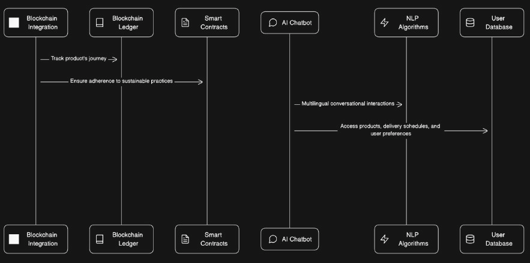
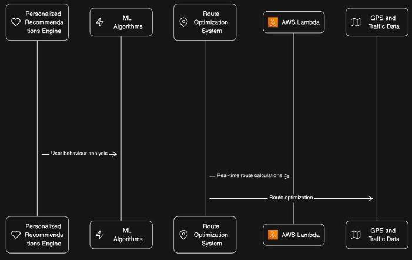
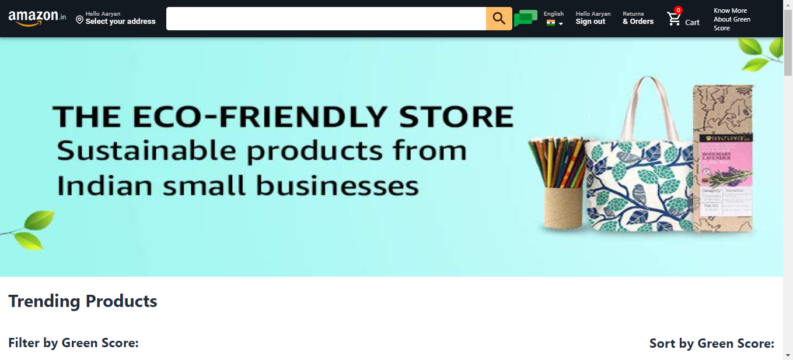
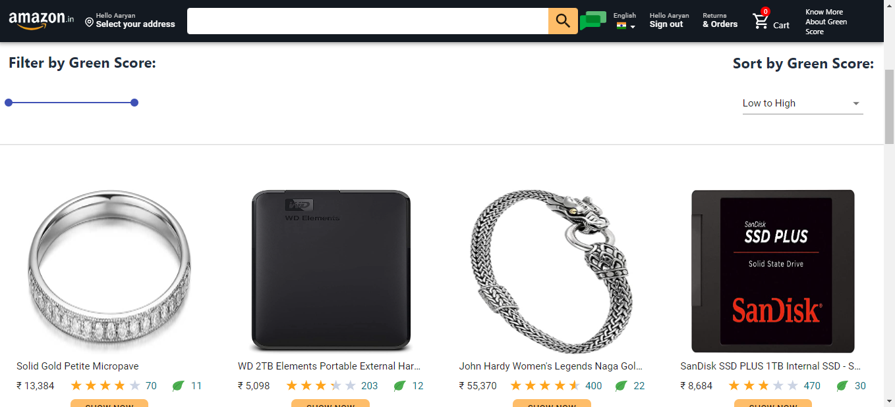
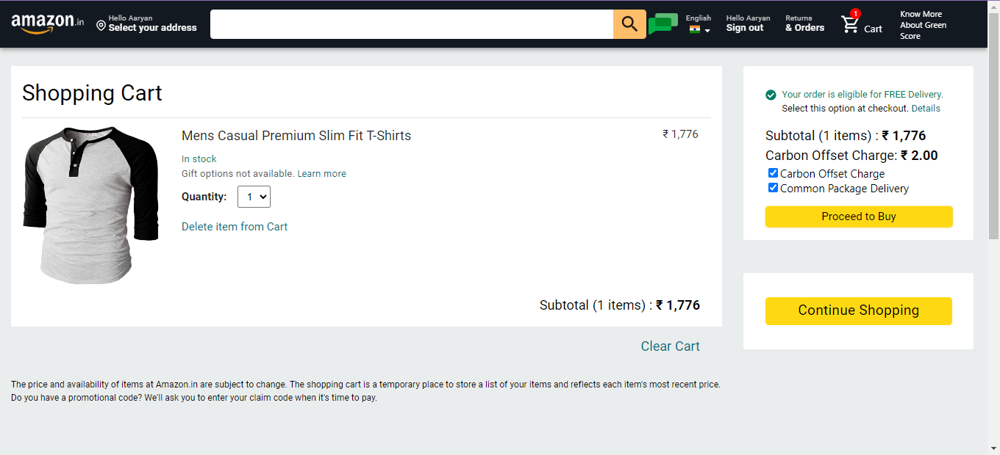
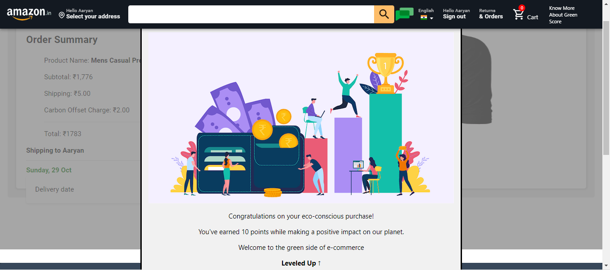
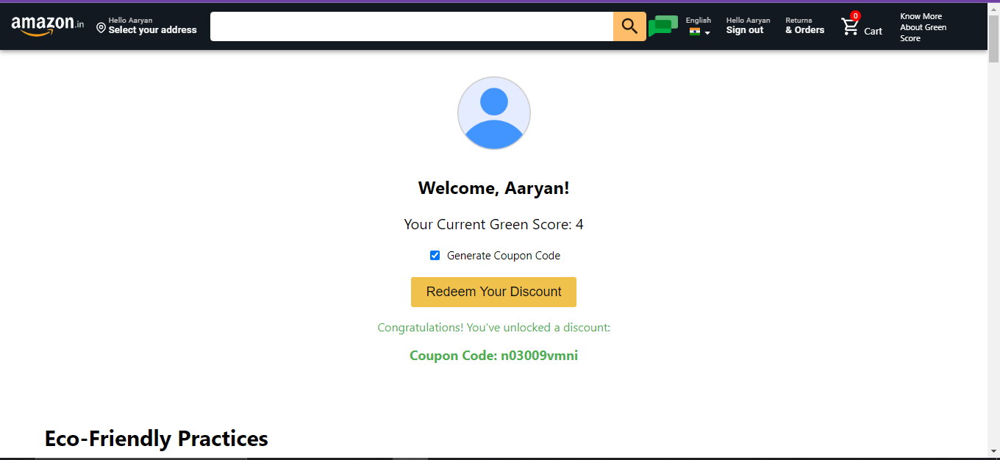

# Hackon Green Commerce Demo - Team Aariaabhi

## Theme
Green Commerce

## Team Members
- Rishit Toteja
- Abhijeet Thakur
- Aaryan Arora
- Aayush Patel
  
## Video Demo ([Video Link](https://youtu.be/1QuW1o5fiAE))

https://github.com/aaryan2134/Aariaabhi/assets/77073932/2c2e76b0-6bb1-4295-8600-e0b3629cd681

## Presentation
[Link to PPT](Aariaabhi_HackOn.pdf)

## Problem Statement

In this environmentally focused theme, the challenge is to create a platform where
Amazon prioritizes sustainable and eco-friendly products, and optimize the supply chain to reduce
carbon footprint and promote zero waste or biodegradable packaging.

## What it does?
1. Eco-Friendly products based Scoring and Sorting System
2. AI Chatbot Integration with Personalized Recommendations
3. Green Score & discount coupons
4. Carbon Off setting Fee
5. Consumer Education Hub

## Tech Stack
1. ReactJS
2. HTML
3. CSS
4. JavaScript
5. NodeJS
6. ExpressJS
7. Python
8. Firebase

## How to use it?
1. Use `npm install` to install all the dependencies.
2. Use `npm start` to start the server.
3. Do they steps seperately for both the folders i.e. `frontend` and `server`.

## Screenshots

